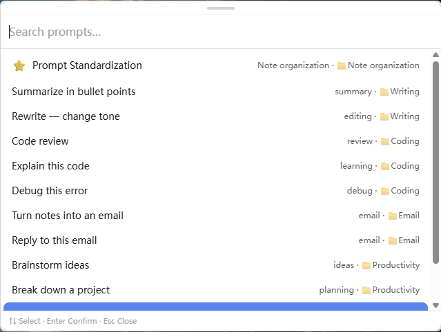
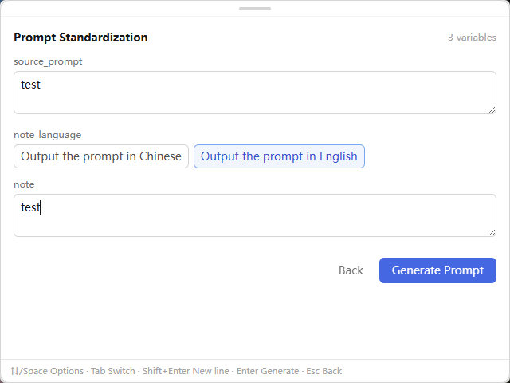
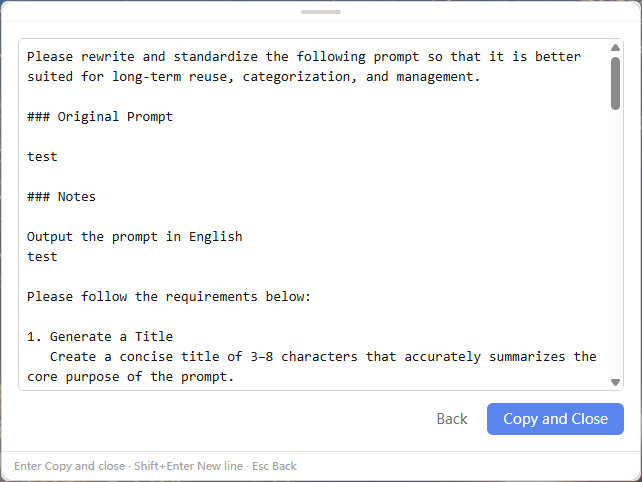
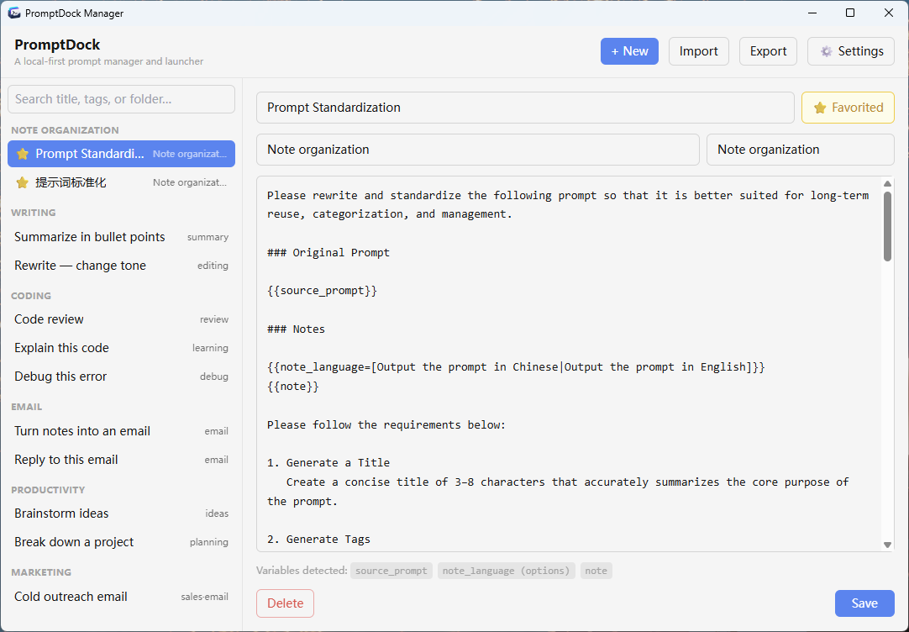
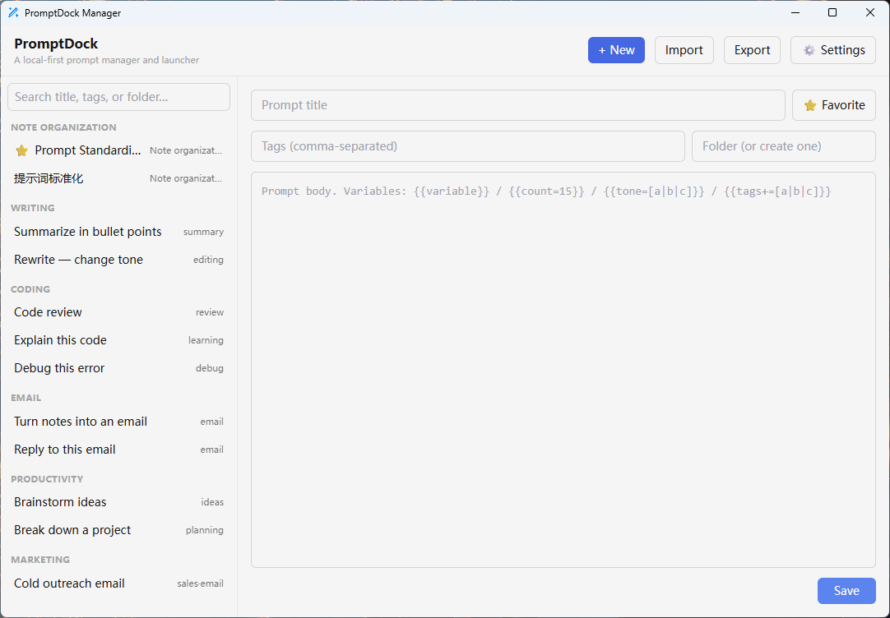
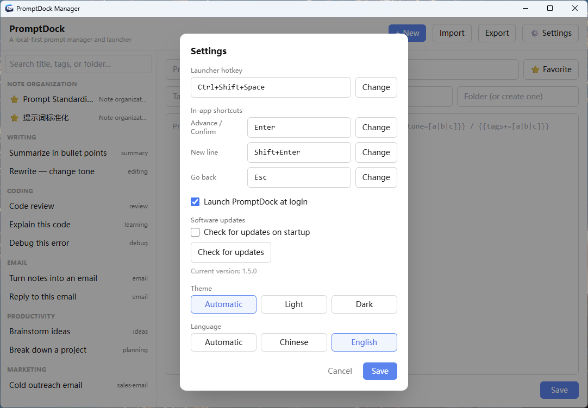

<div align="center">


# PromptDock

**A lightweight prompt manager and launcher for Windows and macOS.**

[](./package.json)
[](#system-requirements)
[](https://tauri.app/)
[](https://www.rust-lang.org/)

[English](./README.md) | [简体中文](./README_CN.md)

[Project repository](https://github.com/Q-Hz/promptdock) · [Download installers](https://github.com/Q-Hz/promptdock/releases)

</div>

---

PromptDock keeps reusable prompts one shortcut away. Organize prompts locally, search them from a lightweight launcher, fill in variables, review the generated text, and copy it without opening a browser or signing in to an account.

## Why PromptDock?

| Instant access | Local and private | Structured library | Flexible templates |
| :--- | :--- | :--- | :--- |
| Open the launcher from anywhere with a global shortcut. | Prompts and settings stay in a local SQLite database. | Organize prompts with folders, tags, favorites, and usage history. | Turn reusable variables and choices into a ready-to-copy prompt. |

## Key features

- **Global launcher** — Press `Ctrl + Shift + Space` on Windows or `Command + Shift + Space` on macOS by default to open PromptDock from any application.
- **Prompt variables** — Use text variables, defaults, selectable values, and multi-select values.
- **Prompt management** — Create, edit, delete, group, tag, and favorite prompts in the manager window.
- **Fast search** — Search prompt titles, tags, and folders; navigate results with the keyboard.
- **Local storage** — No account, cloud service, or remote database is required.
- **Import and export** — Import and export JSON.

## Installation

### System requirements

- Windows 10 or Windows 11 (x64), or macOS 11 or later on Apple Silicon
- Permission to install a desktop application

### Install with the EXE installer

1. Open the [PromptDock Releases page](https://github.com/Q-Hz/promptdock/releases).
2. Download the latest `PromptDock_<version>_x64-setup.exe` file.
3. Run the installer and launch PromptDock from the Windows Start menu.
4. Press `Ctrl + Shift + Space` to open the prompt launcher.

PromptDock continues running in the system tray. Closing the manager window does not quit the application; use **Quit** from the tray menu when you want to stop it completely.

### Install with the DMG (Apple Silicon Mac)

1. Open the [PromptDock Releases page](https://github.com/Q-Hz/promptdock/releases).
2. Download the latest Apple Silicon `.dmg`, open it, and drag PromptDock to Applications.
3. The first macOS release uses ad-hoc signing and is not notarized by Apple, so macOS may block its first launch. Try opening it normally first, then go to **System Settings → Privacy & Security**, verify the app source, and choose **Open Anyway**.
4. Press `Command + Shift + Space` to open the prompt launcher.

Do not disable Gatekeeper globally to install PromptDock. Organization-managed Macs without permission to use **Open Anyway** are not supported. The first macOS release supports Apple Silicon only, not Intel Macs.

## App tour and usage guide

### 1. Global launcher

Press `Ctrl + Shift + Space` on Windows or `Command + Shift + Space` on macOS (default shortcuts, changeable in Settings) from any application to bring up the launcher. Type a keyword to search prompt titles, tags, and folders, with full keyboard navigation.



### 2. Fill in variables and generate

When you select a prompt that contains variables, a form opens so you can fill the preset placeholders. Variables are defined in the prompt content, and four kinds are available, each rendered as a different control:

| Variable type | Syntax example | Rendered as |
| :--- | :--- | :--- |
| Text variable | `{{source_prompt}}` | Text input |
| Text variable with default | `{{source_prompt=test}}` | Text input (pre-filled) |
| Single choice | `{{note_language=[answer in Chinese\|answer in English]}}` | Dropdown |
| Multi-select | `{{tone+=[formal\|polite\|friendly]}}` | Checkboxes (selected values joined by `, `) |



Once the variables are filled in, you can preview the final prompt. Choose **Copy and Close** when it looks good, and the result goes to the clipboard while the window hides itself.



### 3. Prompt Manager

Open the manager from the tray menu to create, edit, and delete prompts, and organize them with folders, tags, and favorites. The list shows each prompt's title, content, and tags at a glance.



Click **New** to add a prompt: enter a title and content, optionally set tags, a folder, and favorite status, and use variable syntax in the content.



#### Variable syntax

Declare variables in the prompt content with double curly braces `{{ }}`; the launcher renders a form for them when the prompt is used:

- **Text variable** — `{{source_prompt}}`: fill in any content in a text input.
- **Default value** — `{{source_prompt=test}}`: the text after `=` is the default, pre-filled and editable.
- **Single choice** — `{{note_language=[answer in Chinese|answer in English]}}`: candidates are separated by `|` inside the brackets and picked from a dropdown.
- **Multi-select** — `{{tone+=[formal|polite|friendly]}}`: pick multiple values via checkboxes; selected values are joined by `, ` by default, and you can use `~` to choose a custom separator (supports `\n` and `\t` escapes), e.g. `{{lines+=[a|b|c]~\n}}` puts each value on its own line.

#### Write prompts faster with Prompt Standardization

PromptDock ships with a built-in template named **Prompt Standardization**. If you are not familiar with the variable syntax yet, use it: paste one of your everyday prompts, send it to the AI, and it will be rewritten into a well-formed prompt that follows PromptDock's variable syntax. Save the result as a new prompt and you are done.

### 4. Settings

The global shortcut, theme (light/dark), interface language, launch-at-startup behavior, and app updates can all be adjusted in the settings view.



## Improve prompts with AI

If you already have prompts that you use regularly, you can refine them with the built-in **提示词标准化 (Prompt Standardization)** template:

1. Open **提示词标准化 (Prompt Standardization)** and enter the original prompt you want to improve.
2. Ask an AI assistant to rewrite it into a clearer, more consistent prompt based on your requirements.
3. Add the optimized prompt to Prompt Manager, then assign tags, a folder, favorite status, and variables as needed.

## Data and privacy

PromptDock stores prompts and settings locally at:

```text
Windows: %APPDATA%\com.promptdock.app\prompts.db
macOS:   ~/Library/Application Support/com.promptdock.app/prompts.db
```

## Run from source

### Prerequisites

- [Node.js](https://nodejs.org/) 22 LTS (22.6 or newer)
- [Rust](https://rustup.rs/) stable toolchain
- Windows: Microsoft C++ Build Tools with the **Desktop development with C++** workload, plus Microsoft Edge WebView2 Runtime
- macOS: Xcode Command Line Tools (`xcode-select --install`)

After installing Rust, open a new terminal and confirm that Cargo is available:

```powershell
cargo --version
```

### Start the development version

```powershell
git clone https://github.com/Q-Hz/promptdock.git
cd promptdock
npm install
npm run tauri dev
```

## Technology stack

- Tauri 2 and Rust
- Vue 3, TypeScript, and Vite
- Tailwind CSS
- SQLite via `rusqlite`

## Project structure

```text
src/                         Vue frontend
  components/                Launcher, manager, and settings views
  lib/                       Tauri API, preferences, i18n, and prompt utilities
src-tauri/                   Rust/Tauri application
  src/main.rs                Database, tray, shortcuts, clipboard, and commands
  src/default-prompts.json   Bundled default prompts
tests/                       Frontend utility tests
```

## Contributing

Issues and pull requests are welcome. Before submitting a change, run the frontend and Rust tests and avoid committing local databases, exported prompt libraries, or build artifacts.

## Acknowledgements

PromptDock was inspired to some extent by the [PromptDeck browser extension](https://www.promptdeck.site/). PromptDock can still import JSON files exported by PromptDeck (`format: "promptdeck"`), and also accepts the `promptdock` format; files exported by PromptDock use the `promptdeck` format.
