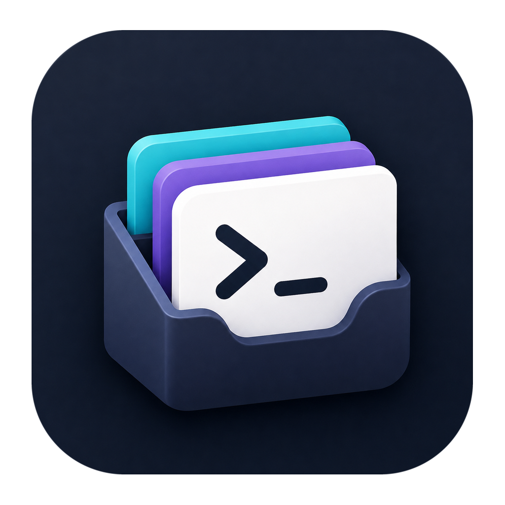
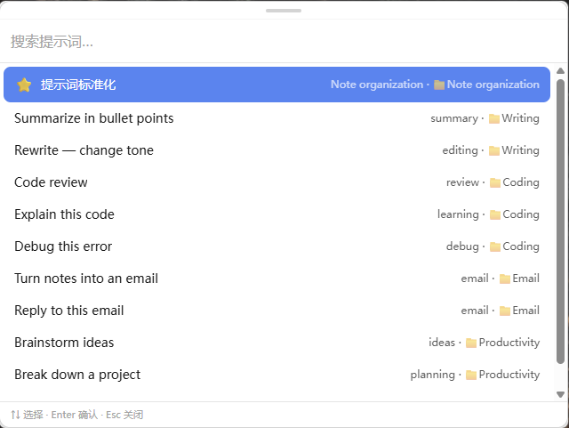
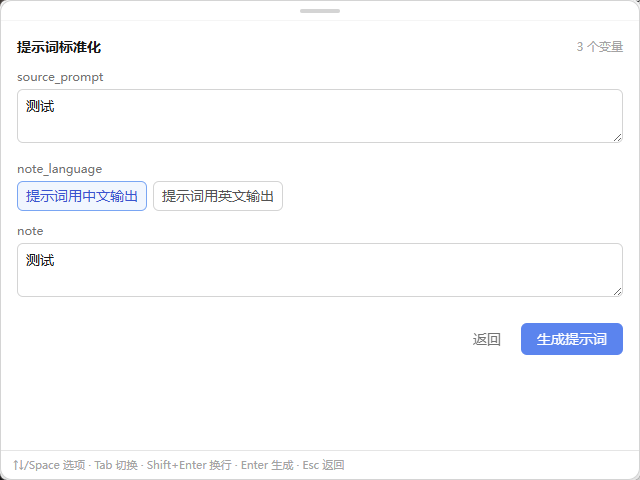
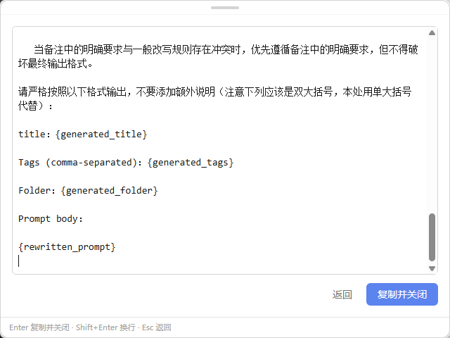
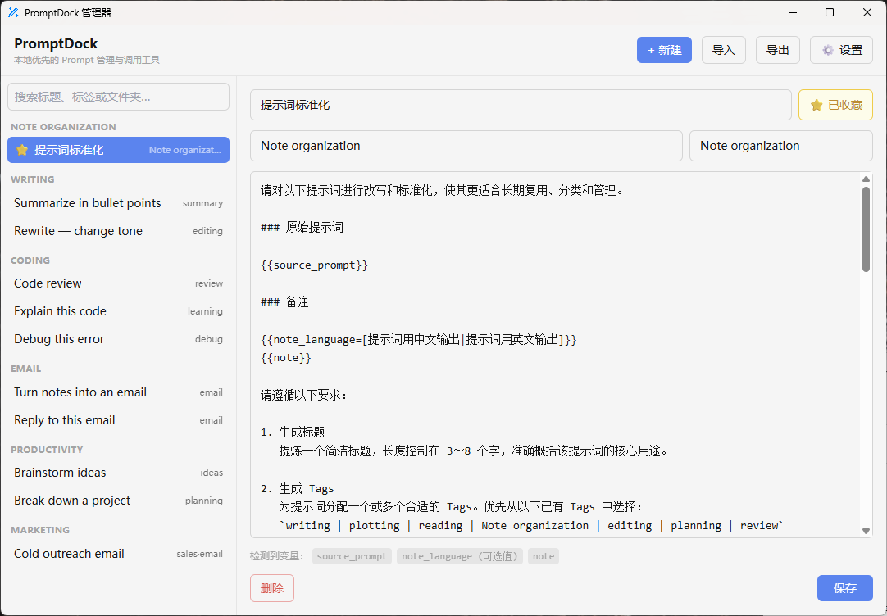
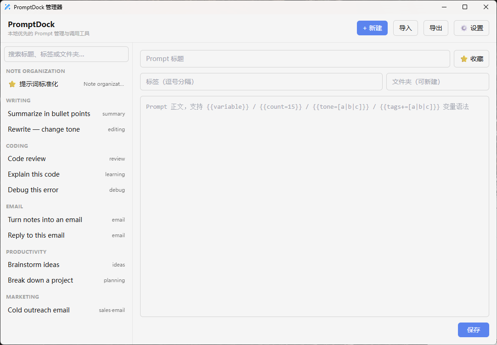
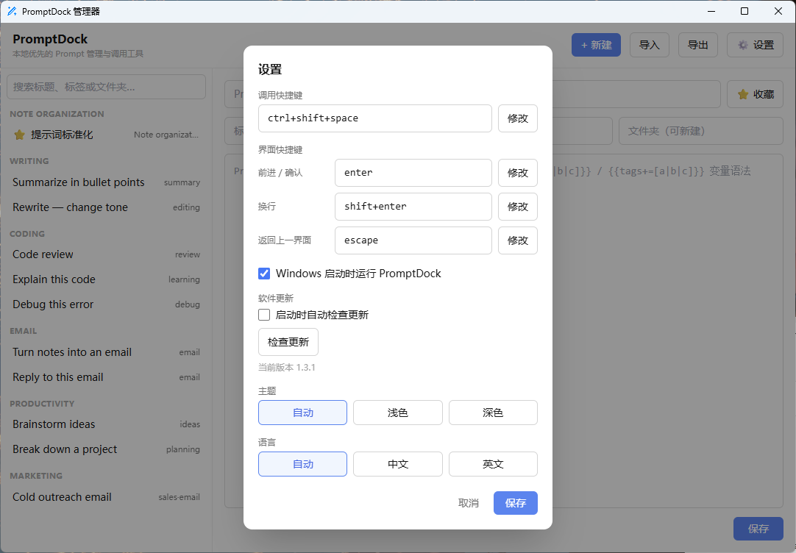

<div align="center">



# PromptDock

**一款快速、本地优先的 Windows 与 macOS Prompt 管理与调用工具。**

[](./package.json)
[](#系统要求)
[](https://tauri.app/)
[](https://www.rust-lang.org/)

[English](./README.md) | [简体中文](./README_CN.md)

[项目主页](https://github.com/Q-Hz/promptdock) · [下载安装包](https://github.com/Q-Hz/promptdock/releases)

</div>

---

PromptDock 让常用提示词随时可用。你可以在本地整理 Prompt，通过轻量调用窗口快速搜索、填写变量、检查生成结果并复制，全程不需要打开浏览器或登录账号。

## 为什么选择 PromptDock？

| 随时调用 | 本地隐私 | 结构化管理 | 灵活模板 |
| :--- | :--- | :--- | :--- |
| 使用全局快捷键，从任意软件快速打开调用窗口。 | Prompt 和设置保存在本地 SQLite 数据库中。 | 使用文件夹、标签、收藏和调用历史整理提示词。 | 通过变量和选项将模板快速生成为可复制的 Prompt。 |

## 主要功能

- **全局调用窗口**：Windows 默认按下 `Ctrl + Shift + Space`，macOS 默认按下 `Command + Shift + Space`，即可从任意软件打开 PromptDock。
- **Prompt 变量**：支持文本变量、默认值、可选值和多选值。
- **提示词管理**：在管理器中创建、编辑、删除、分组、添加标签或收藏 Prompt。
- **快速搜索**：支持搜索 Prompt 标题、标签和文件夹，并可使用键盘选择结果。
- **本地存储**：不需要账号、云服务或远程数据库。
- **导入与导出**：可以导入导出JSON。

## 安装与使用

### 系统要求

- Windows 10 或 Windows 11（x64）；或 macOS 11 及以上（Apple Silicon）
- 具备安装桌面软件的权限

### 使用 EXE 安装

1. 打开 [PromptDock Releases 页面](https://github.com/Q-Hz/promptdock/releases)。
2. 下载最新版 `PromptDock_<版本号>_x64-setup.exe`。
3. 运行安装程序，然后从 Windows 开始菜单启动 PromptDock。
4. 按下 `Ctrl + Shift + Space` 打开提示词调用窗口。

PromptDock 会继续在系统托盘中运行。关闭管理器窗口不会退出软件；如果需要完全退出，请在托盘菜单中选择**退出**。

### 使用 DMG 安装（Apple Silicon Mac）

1. 打开 [PromptDock Releases 页面](https://github.com/Q-Hz/promptdock/releases)。
2. 下载最新版 Apple Silicon `.dmg`，打开后把 PromptDock 拖入“应用程序”。
3. 首次打开时，由于当前版本采用 ad-hoc 签名且未经 Apple 公证，macOS 可能阻止启动。请先正常尝试打开，然后前往**系统设置 → 隐私与安全性**，确认应用来源无误后选择**仍要打开**。
4. 启动后按下 `Command + Shift + Space` 打开提示词调用窗口。

请勿为安装 PromptDock 全局关闭 Gatekeeper。受组织策略管理且没有“仍要打开”权限的 Mac 暂不支持。首个 macOS 版本仅支持 Apple Silicon，不支持 Intel Mac。


## 应用界面与使用指南

### 1. 全局调用窗口

在任意软件中按下 `Ctrl + Shift + Space`（默认按键，可在设置中修改），即可唤出调用窗口。输入关键词即可按标题、标签和文件夹快速搜索，全程支持键盘操作。



### 2. 填写变量并生成

选中包含变量的 Prompt 后，会弹出对应的填写表单，对 Prompt 中预设位置的内容进行填充。在设置 Prompt 时即可加入变量语法，共有四种变量可用，调用时呈现为不同的控件：

| 变量类型 | 语法示例 | 调用时呈现 |
| :--- | :--- | :--- |
| 文本变量 | `{{source_prompt}}` | 输入框 |
| 带默认值的文本变量 | `{{source_prompt=test}}` | 输入框（预填默认值） |
| 可选值 | `{{note_language=[提示词用中文输出\|提示词用英文输出]}}` | 下拉选项 |
| 多选值 | `{{tone+=[正式\|客气\|友好]}}` | 复选框（勾选值用 `, ` 连接） |



填写完成后即可预览生成的最终 Prompt，确认无误后选择**复制并关闭**，内容进入剪贴板，窗口自动收起。



### 3. Prompt 管理器

从托盘菜单打开管理器，可以创建、编辑、删除 Prompt，并用文件夹、标签和收藏整理。列表中可以直接查看每条 Prompt 的标题、内容和标签。



点击**新建**即可添加 Prompt：填写标题和内容，按需设置标签、文件夹、收藏状态，并在内容中使用变量语法。



#### 变量语法

在 Prompt 内容中用双大括号 `{{ }}` 声明变量，调用时即可在弹出的表单中填充：

- **文本变量**：`{{source_prompt}}`，调用时在输入框中填写任意内容。
- **带默认值**：`{{source_prompt=test}}`，等号后为默认值，调用时已预填，可直接修改。
- **可选值**：`{{note_language=[提示词用中文输出|提示词用英文输出]}}`，方括号内用 `|` 分隔候选值，调用时从下拉选项中选择。
- **多选值**：`{{tone+=[正式|客气|友好]}}`，调用时以复选框勾选多个值，勾选的值默认用 `, ` 连接；也可以用 `~` 指定连接符（支持 `\n`、`\t` 转义），例如 `{{lines+=[a|b|c]~\n}}` 会把每个值单独一行拼接。

#### 用“提示词标准化”快速编写

软件安装后默认自带一条名为**提示词标准化**的 Prompt。你可以直接使用它，把你自己常用的提示词填进去发给 AI，AI 会将其改写为符合 PromptDock 变量语法要求的规范提示词，再把结果保存为新 Prompt 即可。

### 4. 设置

全局快捷键、主题（亮/暗）、界面语言、开机启动和软件更新等选项都可以在设置界面中调整。



## 使用 AI 优化提示词

如果已有常用提示词，可以使用软件内置的 “提示词标准化” 进行优化：

1. 打开 “提示词标准化”，输入需要优化的原始提示词。
2. 让 AI 根据要求生成更加清晰、规范的提示词。
3. 将优化后的提示词添加到 Prompt 管理器，并需要设置标签、文件夹、收藏状态和变量。

## 数据与隐私

PromptDock 的 Prompt 和设置保存在本地：

```text
Windows: %APPDATA%\com.promptdock.app\prompts.db
macOS:   ~/Library/Application Support/com.promptdock.app/prompts.db
```

## 从源码运行

### 环境要求

- [Node.js](https://nodejs.org/) 20 LTS 或更高版本
- [Rust](https://rustup.rs/) stable 工具链
- Windows：Microsoft C++ Build Tools（**Desktop development with C++** 工作负载）和 Microsoft Edge WebView2 Runtime
- macOS：Xcode Command Line Tools（运行 `xcode-select --install`）

安装 Rust 后，请重新打开终端并确认 Cargo 能被识别：

```powershell
cargo --version
```

### 启动开发版本

```powershell
git clone https://github.com/Q-Hz/promptdock.git
cd promptdock
npm install
npm run tauri dev
```

## 技术栈

- Tauri 2 与 Rust
- Vue 3、TypeScript 与 Vite
- Tailwind CSS
- SQLite（`rusqlite`）

## 项目结构

```text
src/                         Vue 前端
  components/                调用、管理和设置界面
  lib/                       Tauri API、偏好设置、国际化和 Prompt 工具
src-tauri/                   Rust/Tauri 应用
  src/main.rs                数据库、托盘、快捷键、剪贴板和命令
  src/default-prompts.json   软件内置的默认 Prompt
tests/                       前端工具测试
```

## 参与贡献

欢迎提交 Issue 和 Pull Request。提交修改前，请运行前端与 Rust 测试，并避免提交本地数据库、导出的个人 Prompt 文件或构建产物。

## 致谢

PromptDock 的产品思路在一定程度上受到 [PromptDeck 浏览器插件](https://www.promptdeck.site/) 的启发。目前 PromptDock 仍兼容导入 PromptDeck 导出的 JSON 文件（`format: "promptdeck"`），同时也支持 `promptdock` 格式；由 PromptDock 导出的文件使用 `promptdeck` 格式。
